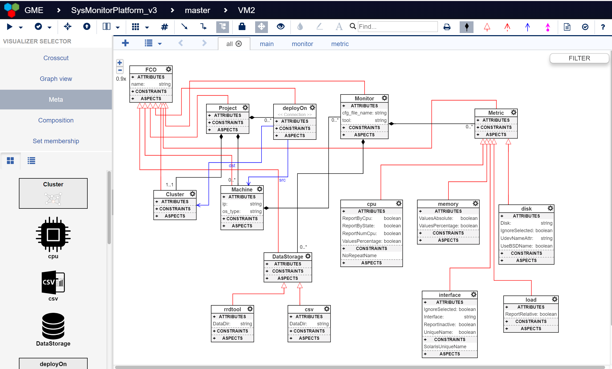
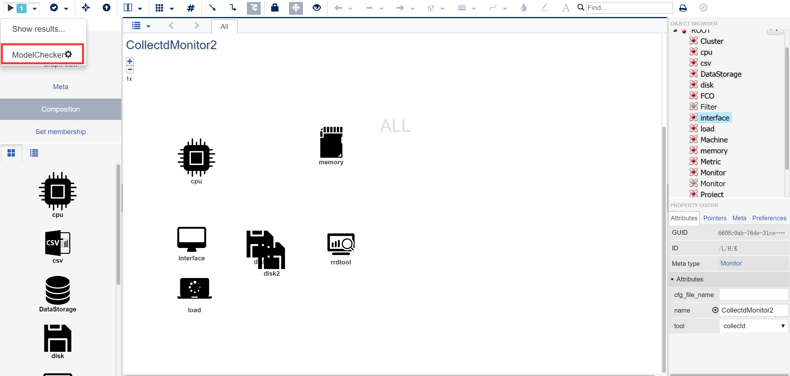
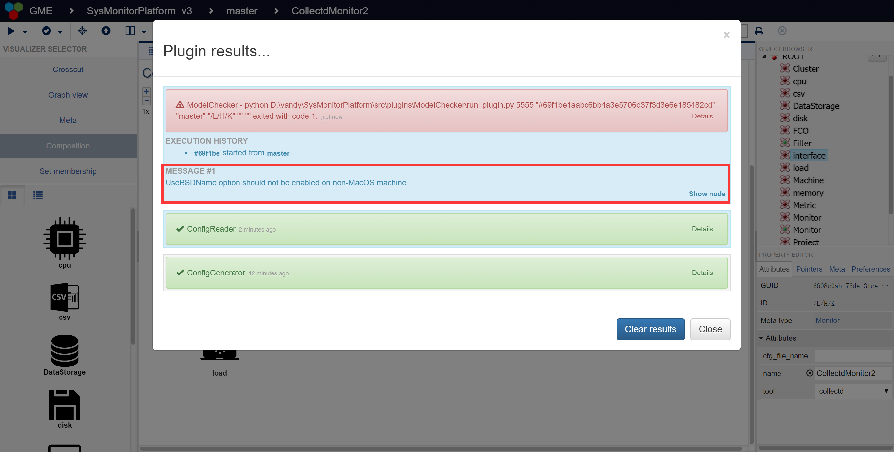
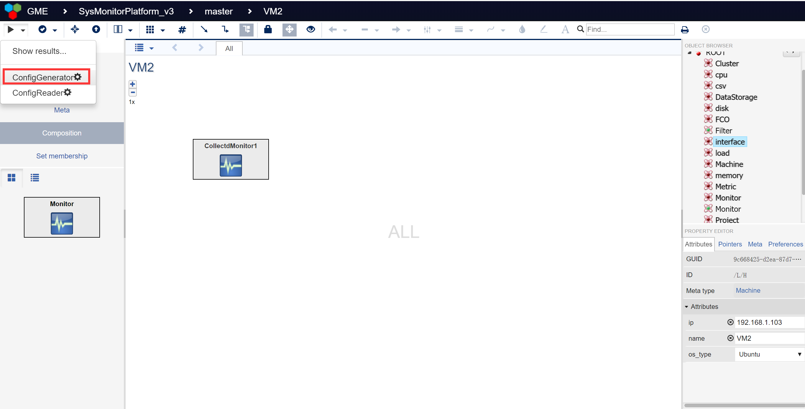
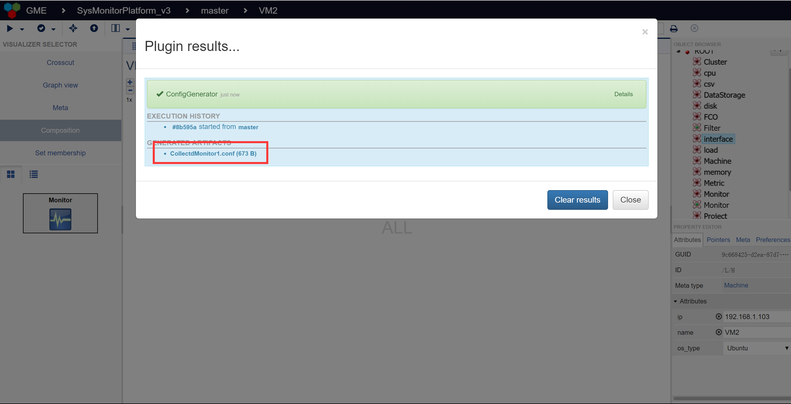
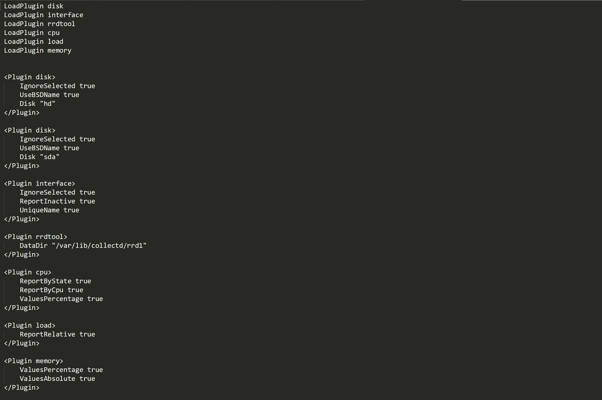
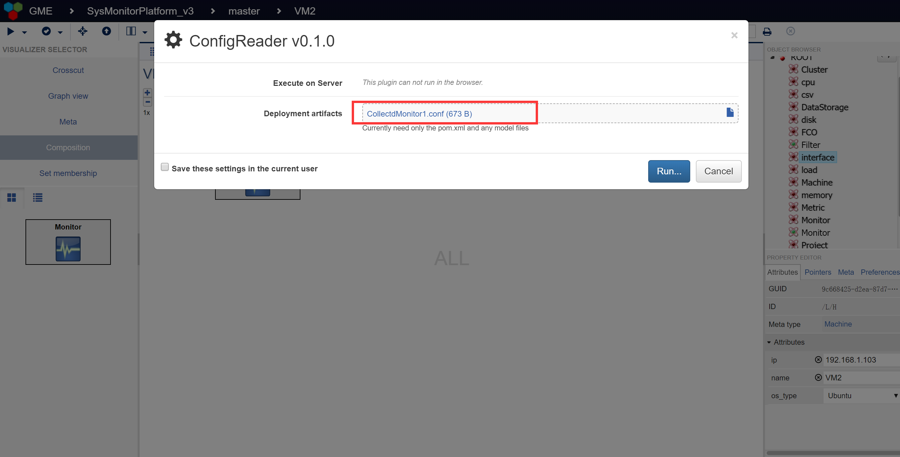

# A System Monitor Platform Based On Collectd
## Installation
First, install the mygme following:
- [webgme](https://webgme.readthedocs.io/en/latest/getting_started/dependencies.html/)
- [collcetd](https://collectd.org/)
- [collectd-web](https://www.tecmint.com/install-collectd-and-collectd-web-to-monitor-server-resources-in-linux//)

Second, start mongodb locally by running the `mongod` executable in your mongodb installation (you may need to create a `data` directory or set `--dbpath`).

Then, run `npm start` from the project root to start . Finally, navigate to `http://localhost:8081` to start using mygme!

## Meta-model design

## A simple model instance

## Plugin example
### 1 Check the configuaration correctness

Run the ModelChecker plugin inside a node of meta-type Monitor.

If your configuration is all correct, the plugin will show a successful running state, otherwise, you will get a runtime error as following, and the detail information will be given in the MESSAGE field.

### 2 Generate the configuration file from model

Run the ConfigGnerator plugin inside a node of meta-type Machine.

After running, you can download the generated configuration file from the ARTIFACTS field.

The generated configuration file is something like this.

### 3 Read from a configuration file to generate corresponding model

Run the ConfigReader plugin inside a node of meta-type Machine.

